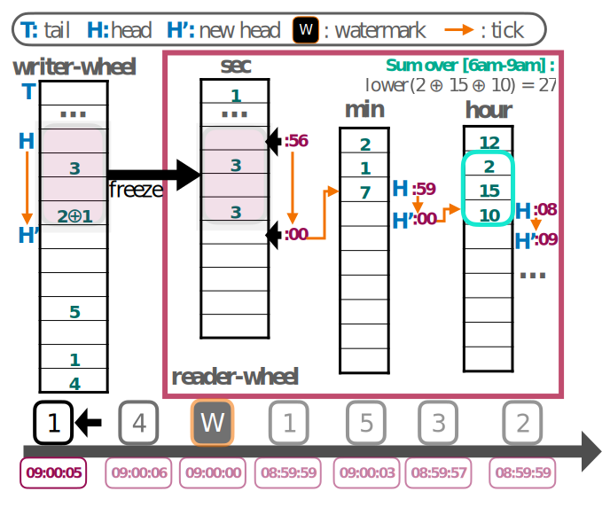
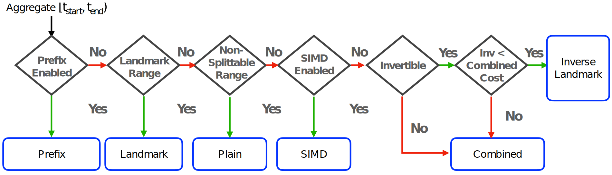

# µWheel Design Doc

This doc describes the design of µWheel.

# Overview

µWheel is an event-driven aggregate management system for the ingestion, indexing, and querying of stream aggregates.

The design of µWheel is centered around [low-watermarking](http://www.vldb.org/pvldb/vol14/p3135-begoli.pdf), a concept found in modern streaming systems (e.g., Apache Flink, RisingWave).
µWheel uses the Low watermark to seperate the write and read paths, but also to index aggregate wheels which gives us 1) fast writes and lookups; 2) implicit timestamps.

Writes are handled by a [Writer Wheel](#Writer-Wheel) which is optimized for single-threaded ingestion of out-of-order aggregates.
Reads are managed by a hierarchically indexed [Reader Wheel](#Reader-Wheel) that employs a wheel-based query optimizer whose cost function
minimizes the number of aggregate operations for a query.

µWheel adopts a [Lazy Synchronization](#Advancing-Time) aggregation approach. Aggregates are only shifted over from the `WriterWheel` to the `ReaderWheel`
once the internal low watermark has been advanced.

  

## Aggregation Framework

µWheels aggregation framework consists of 5 core functions that users must implement:

* ``lift(input) -> MutablePartialAggregate``
    * Lifts input data into a mutable aggregate
* ``combine_mutable(mutable, input)``
    * Combines ⊙ the input data into a mutable aggregate
* ``freeze(mutable) -> PartialAggregate``
    * Freezes the mutable aggregate into an immutable one
* ``combine(a, a) -> a``
    * Combines ⊕ two partial aggregates into a new one
* ``lower(a) -> Aggregate``
    * Lowers a partial aggregate to a final aggregate (e.g., sum/count -> avg)

Down below are some additonal optional functions that users may implement:

* ``combine_simd(slice)``
    * Combines a slice of partial aggregates using explicit SIMD instructions
* ``combine_inverse(a, b)``
    * Deducts a partial aggregate from another
* ``prefix_query(l, r)``
    * Defines how a prefix-sum range query is executed (if supported).
* ``compression()``
    * Defines how partial aggregates can be compressed and decompressed.

µWheel's query optimizer uses these framework provided hints during query planning and execution.

## Writer Wheel

The `WriterWheel` is designed for single-threaded use and high-throughput stream ingestion.
Internally the wheel consists of two wheels: write-ahead and overflow.

### Write-ahead Wheel

The write-ahead wheel is a pre-allocated fixed-sized circular buffer that enables pre-aggregation of 
N time units above the low watermark. For instance, assuming the lowest granularity of seconds and a write-ahead capacity of 64
then the wheel supports mutable aggregations up to 64 seconds above the watermark. 

µWheel users may configure the write-ahead capacity.

### Overflow Wheel

Events with timestamps that exceed the capacity of the ``write-ahead`` wheel are scheduled into a Overflow wheel (Hierarchical Timing Wheel) 
and are inserted once the low watermark has advanced far enough.

## Reader Wheel

The ``ReaderWheel`` indexes complete aggregates hierarchically across multiple time dimensions in a data structure called Hierarchical Aggregate Wheel (HAW).
Internally the Hierarchical Aggregate Wheel consists of multiple event-time indexed wheels,
each maintaining aggregates across a different time granularity. Each wheel may be configured with different data layouts and different retention policies.
HAW is equipped with a wheel-based query optimizer that uses a hybrid cost and heursistics based approach.

### Aggregate Scheme

The default aggregate scheme used is the following:

* Seconds: 60
* Minutes: 60
* Hours: 24
* Days: 7
* Weeks: 52
* Years: 10

Note that each wheel (time dimension) may be configured to hold more than just the latest N slots.

### Data Layout

An aggregate wheel supports three possible data layouts that are configurable per wheel granularity:

* ``Array``: A regular array of partial aggregates.
* ``PrefixArray``: A prefix-enabled array which requires double the space but runs queries in O(1).
* ``CompressedArray``: A compressed array which compresses wheel slots into chunks.

### Queries

µWheel supports the following queries:

* ``window(range, slide)``
    * Installs a periodic streaming window aggregation query.
* ``combine_range(start, end) -> Aggregate``
    * Combines the time range into a final aggregate.
* ``interval(duration) -> Aggregate``
    * Combines the range ``start: watermark() - duration, end: watermark()``
* ``range(start, end) -> Vec<(TimeStamp, Aggregate)>``
    * Returns aggregates and their timestamps in the given time range.

### Query Optimizer

µWheel's query optimizer leverages framework-provided hints such as SIMD compatibility and the invertibility property.
If explicit SIMD support is available then the query planner will favour plans where it can be fully exploited.
On the other hand if vectorized execution is not possible then the optimizer will prioritize reducing the number of aggregate operations instead.

The image below illustrates a flow chart of the query optimizer which aims to select the optimal execution plan.

  

## Advancing Time

Aggregate Synchronization in µWheel refers to the advancement of time, a process which shifts aggregates from the writer wheel to the reader. 
µWheel only performs synchronization lazily once its low watermark is advanced. This design choice has a twofold purpose. 
First, it enables µWheel to avoid costly index maintenance (e.g., tree rebalance) in the hot path of writes. 
Secondly, it creates a clear seperation between writes and reads, enabling concurrent ingestion and querying.
